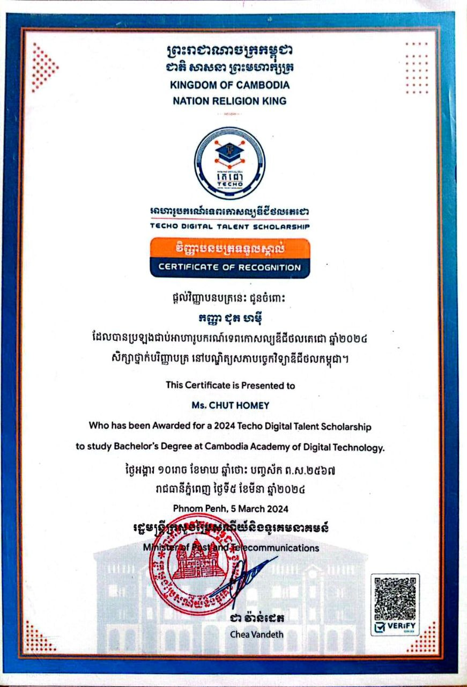

## Hi there, I'm Chut Homey 👋

- 🔭 I’m currently developing my school's final project: **Online Bookstore Platform**
- 🎓 Working on my **Capstone Project: Smart QR Attendance Management System**
- 🌱 I’m currently learning **Flutter, Dart, and Python at CADT**
- 👯 I’m looking to collaborate on **Software Engineering projects**
- 🤔 I’m seeking **internship opportunities in UX/UI Design, Frontend Development, Backend Development, Mobile Development, or Database Management**
- 💬 Ask me about **Personal Development**
- 📫 How to reach me: **[chuthomey3@gmail.com](mailto:chuthomey3@gmail.com)**
- 😄 Pronouns: **She/Her**
- ⚡ Fun fact: I enjoy **reading books, watching movies, exploring new technologies, building small projects, solving coding challenges, traveling, and always learning something new**

---

## 🌐 Contact

  
  &nbsp;&nbsp;
  
  &nbsp;&nbsp;
  

---

# 💻 Tech Stack

  <!-- Programming Languages -->
  
  
  
  
  
  
  
    

  <!-- Web Technologies -->
  
  
  
    

  <!-- Frontend / Backend -->
  
  
  
  
    

  <!-- Databases -->
  
  
  
    

  <!-- Tools / Platforms -->
  
  
  
    

  <!-- Design Tools -->
  
  

---
## 🎓 Certificates

Here are some certificates I’ve earned:

  
  
    
  
  
    
  
  
    
  
  

# 📊 GitHub Stats

  <!-- Main Stats -->
  
    

  <!-- Streak Stats -->
  
    

  <!-- Top Languages -->
  

---

## 🏆 GitHub Trophies

  <!-- Fallback image: always show a trophy placeholder -->
  

---

### ✍️ Random Dev Quote

  

---

### 🔝 Top Contributed Repo

  <!-- Fallback placeholder if no contributions yet -->
  

